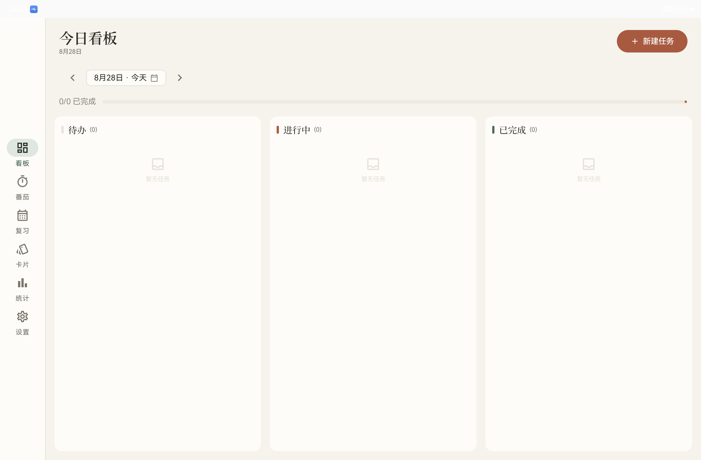
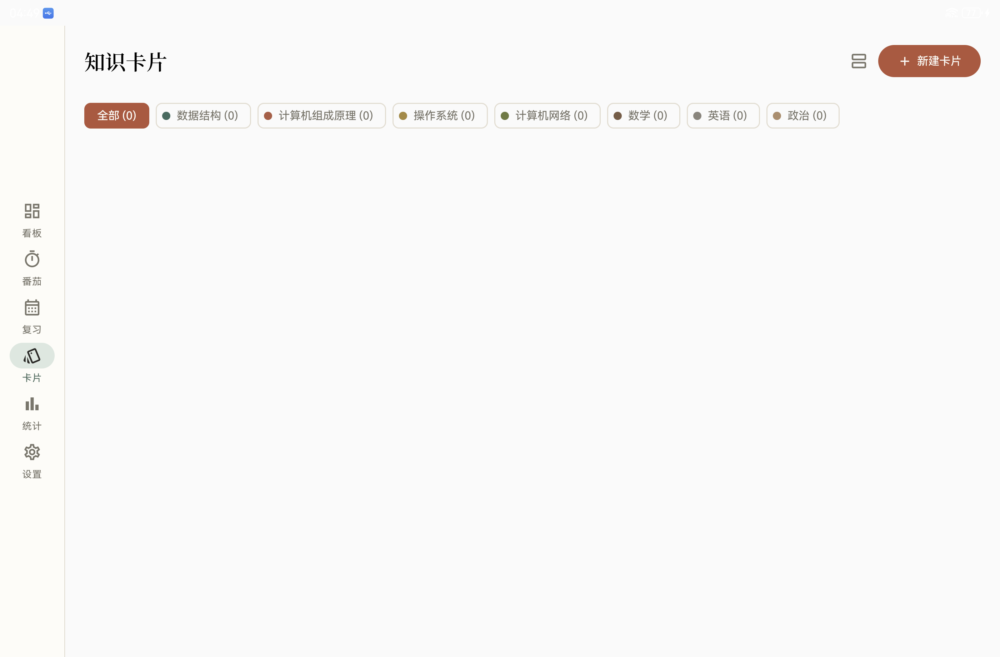
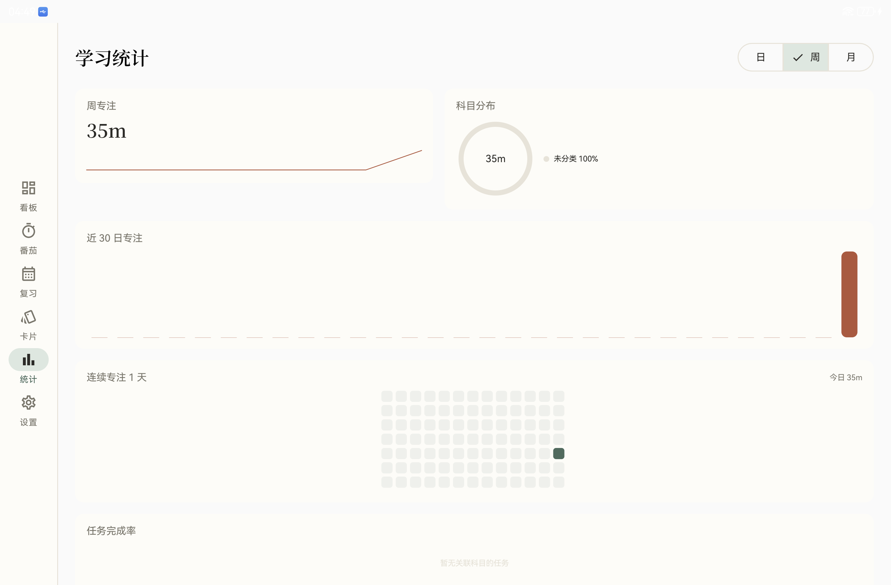
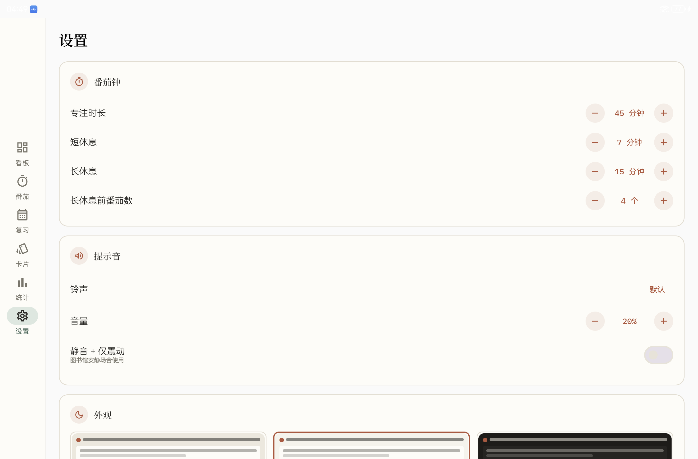

<div align="center">

# 🍅 TomaTodo

**为计算机考研人打造的安卓平板效率工具**

番茄专注 · 任务看板 · 知识卡片 · 遗忘曲线复习 · 学习统计 —— 一站式学习闭环

[](https://github.com/Adonis-CJ/TomaToDo)
[](https://kotlinlang.org)
[](https://developer.android.com/jetpack/compose)
[](LICENSE)

</div>

---

## 为什么是 TomaTodo？

市面上的番茄钟、Todo、Anki 各自独立、数据割裂。TomaTodo 把考研学习的完整闭环放进一个
**本地优先、离线可用、平板适配** 的应用里：

```
一次规划 ──▶ 专注执行 ──▶ 拍照记错题 ──▶ 遗忘曲线复习 ──▶ 周末复盘
 (看板)      (番茄钟)       (知识卡片)        (复习计划)       (统计)
```

所有数据保存在你的设备上——无账号、无联网、无埋点。

## ✨ 功能特性

- **🎯 自定义番茄钟** — 专注/短休/长休时长与长休间隔全可调；前台服务保证锁屏计时不中断；**悬浮小窗**在看别的资料时也能掌控计时；多种提示音 + 独立音量 + **静音仅震动**（图书馆友好）
- **📋 Todo 看板** — 任务卡片按「待办 / 进行中 / 已完成」三列展示，三态视觉语言（色条 + 勾选框 + 划线）一眼可辨；**日期导航**回看历史、预排未来；今日完成进度一目了然；滑动删除可撤销；一键从卡片启动番茄并自动关联
- **🗂 知识卡片** — 按科目分组织（筛选 Chip + 分组模式）；**专属撰写页**支持拍照/相册记错题（自动压缩、全屏缩放查看）、标签、来源、实时预览翻转
- **🔁 遗忘曲线复习** — 艾宾浩斯间隔（1/2/4/7/15/30 天）按「忘记/模糊/记得」动态排程；单卡沉浸刷题模式；复习历史留痕
- **📊 学习统计** — 近 30 日专注柱状图、科目分布环形图、12 周打卡热力图、按科目完成率；日/周/月切换；CSV 导出与周报分享
- **🧩 学科体系** — 预置 408 四科 + 数/英/政，支持自定义科目与暖色标识色
- **💾 数据安全** — 全量 ZIP 备份（含卡片图片），导入自动兼容旧版 JSON

## 📸 截图

| 看板 | 知识卡片 |
|---|---|
|  |  |

| 学习统计 | 设置 |
|---|---|
|  |  |

## 🛠 技术栈

| 层 | 选型 |
|---|---|
| 语言 | Kotlin 2.2 |
| UI | Jetpack Compose + Material 3，「墨·纸」暖色设计系统 |
| 架构 | MVVM + Repository + 单向数据流（StateFlow） |
| 持久化 | Room 2.8（schema 版本化迁移）+ DataStore |
| 后台 | Foreground Service（计时）+ 悬浮窗 WindowManager |
| 图片 | CameraX 契约拍照 + Photo Picker + Coil |
| 构建 | AGP 9 / Gradle 9.1 / KSP |

**设计**：[PRD.md](PRD.md)（产品需求文档）

字体：[Noto Serif SC](https://fonts.google.com/specimen/Noto+Serif+SC) 与 [IBM Plex Mono](https://fonts.google.com/specimen/IBM+Plex+Mono)（均 SIL OFL 授权）。

## 🚀 构建运行

**环境要求**：Android Studio（最新稳定版）、JDK 17+、Android SDK 36

```bash
# 命令行构建
./gradlew :app:assembleDebug

# 运行单元测试
./gradlew :app:testDebugUnitTest
```

产物：`app/build/outputs/apk/debug/app-debug.apk`，直接安装到 Android 8.0+（平板体验最佳）设备。

也可以在 Android Studio 中打开本项目，选择平板模拟器或真机直接 Run。

## 📁 项目结构

```
app/src/main/java/com/tomatodo/
├── data/              # Room 实体/DAO、DataStore、备份
├── timer/             # 计时控制器、前台服务、悬浮窗
├── ui/
│   ├── board/         # 看板（三态卡片、日期导航）
│   ├── cards/         # 知识卡片（撰写页、图片查看器）
│   ├── review/        # 复习（刷题模式）
│   ├── stats/         # 统计（Canvas 自绘图表）
│   ├── settings/      # 设置（分组卡片）
│   └── theme/         # 墨·纸设计令牌与字体
└── ...
```

## 🗺 Roadmap

- [ ] 看板科目筛选
- [ ] 字体子集化瘦身（当前宋体全量 ~25MB）
- [ ] 复习到期每日提醒（WorkManager）
- [ ] 桌面小组件

## 📄 License

[MIT](LICENSE) © 2026 Adonis-CJ
